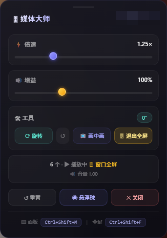

# 🎛 Media Master Pro

> 智能媒体控制器：倍速调节、音量增益、站点记忆、加密存储、视频旋转、画中画、窗口全屏

当前版本：**3.0.9**

## ✨ 功能特性

- ⚡ **倍速控制** — 0.25x ~ 4.0x 自由调节
- 🔊 **音量增益** — 0% ~ 300%，静音时拉动增益会自动取消静音
- 🔄 **视频旋转** — 0° / 90° / 180° / 270°，页面和小窗同步旋转
- 📺 **画中画** — 弹出独立小窗播放，带进度条、播放/暂停和时间显示
- 🖥 **窗口全屏** — 视频铺满当前浏览器窗口，并压住页面顶栏等遮挡层
- 💾 **站点记忆** — 每个网站独立保存倍速、增益、旋转（加密存储）
- 🎨 **浮动面板** — 毛玻璃效果，可拖拽；双击标题栏复位
- ⌨️ **快捷键** — 切换面板、窗口全屏、退出全屏
- 🔒 **隐私安全** — 本地加密存储，数据不上传

## 📦 安装

1. 安装 [Tampermonkey](https://www.tampermonkey.net/) 浏览器扩展
2. 点击 [这里](https://github.com/ItmeiCode/Media-Master-Pro/raw/main/media-master-pro.user.js) 安装脚本
3. 访问任意含有视频/音频的网站即可使用

## 🚀 使用指南

| 操作 | 说明 |
|------|------|
| 倍速滑条 | 调节播放速度 |
| 增益滑条 | 调节音量，大于 100% 为增益 |
| ⟳ 旋转 | 依次切换 0° → 90° → 180° → 270° |
| ↺ | 旋转复位到 0° |
| 📺 画中画 | 进入/退出画中画；小窗可拖进度条、点画面暂停 |
| 🖥 窗口全屏 | 视频充满当前窗口；再次点击或 `Esc` 退出 |
| 拖拽标题栏 | 移动面板位置 |
| 双击标题栏 | 重置面板位置 |
| `Ctrl+Shift+M` | 显示/隐藏面板 |
| `Ctrl+Shift+F` | 窗口全屏 / 退出窗口全屏 |
| `Esc` | 退出窗口全屏 |

画中画开启后，原页面位置会显示「画中画播放中」；关闭小窗后自动恢复。

## 📸 预览

## 🛠 技术栈

- 原生 JavaScript (ES6+)
- Web Audio API（音量增益）
- Document Picture-in-Picture / Picture-in-Picture API
- localStorage（加密存储）
- CSS3（毛玻璃、动画）

## 📄 许可证

MIT © Itmei
